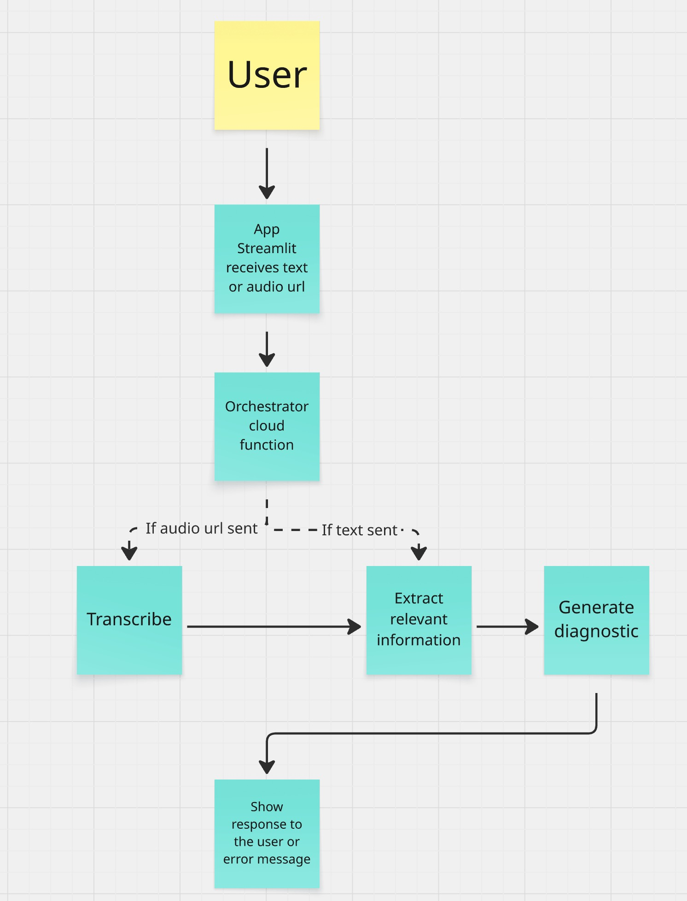
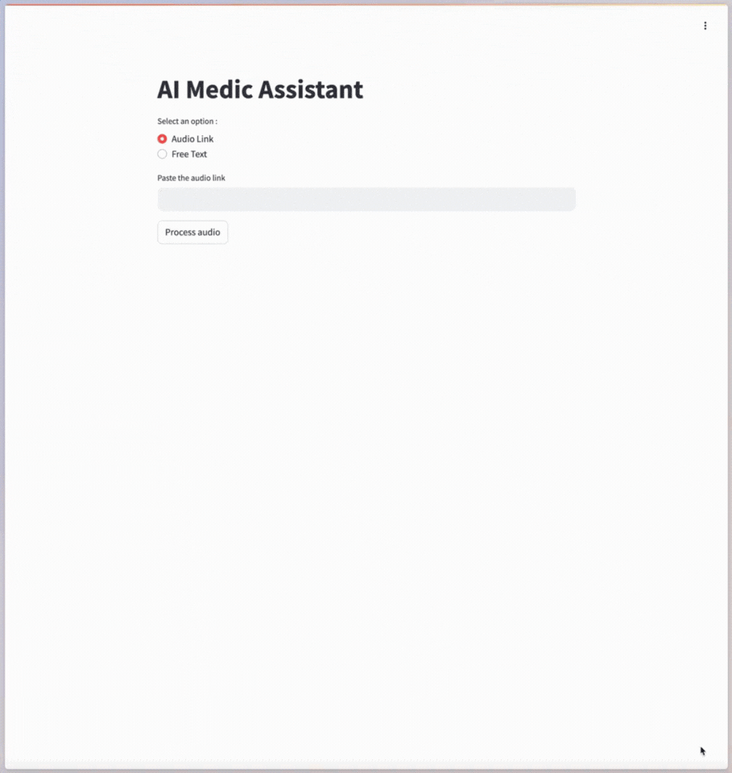
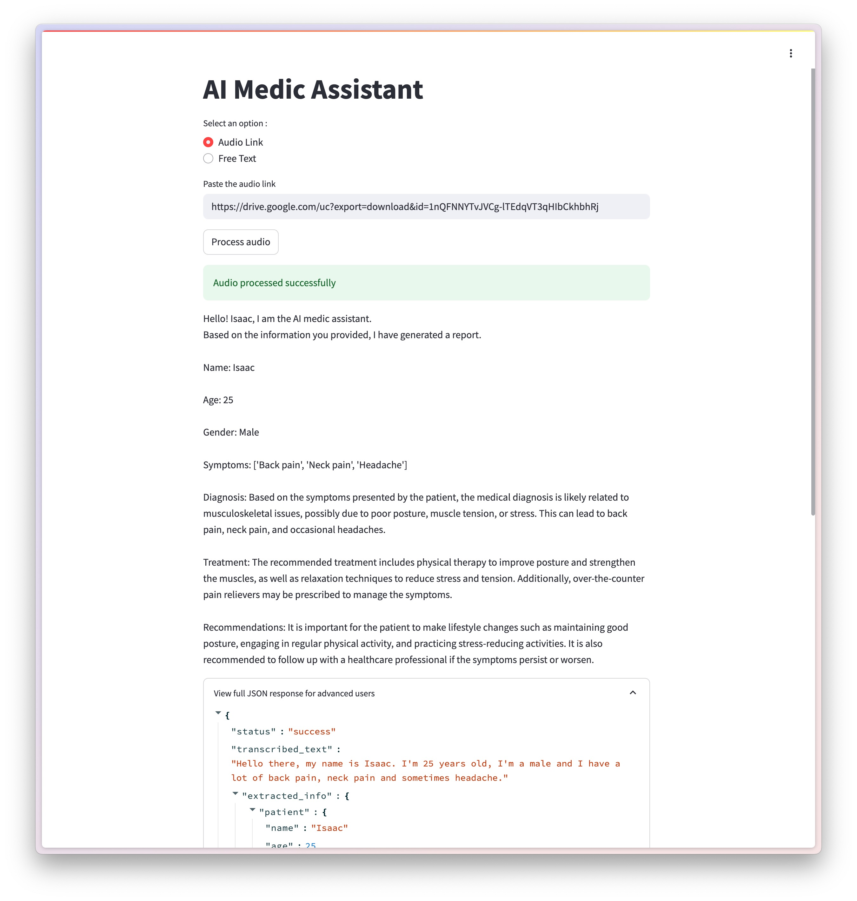
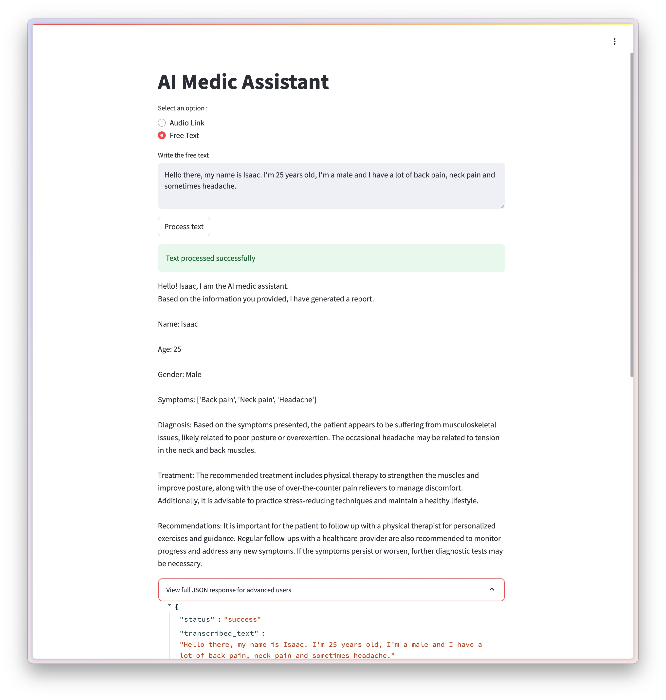

# Proyect description

This project enables a user to insert an audio file url or write plain text with personal information and syntomps. 
Then use Google Cloud serverless functions to perform a transcript (if needed), extract structured and relevant data about the patient and its symptoms, and perform a diagnose.

# Table of contents
1. [Requirements](#-requirements)
2. [Project Structure](#-project-structure)
3. [Configurations (run locally)](#️-configurations-of-the-project-to-run-locally)
4. [Sample use case](#-sample-use-case)
5. [Technical details](#technical-details)

---

# 🔧 Requirements

- Python 3.11.9
- Google Cloud account with `gcloud` CLI installed and configured. Also firebase.
- Open AI API Key 
---

# 📁 Project structure

This project is basically divided into two main components that could be decoupled into microservices if needed.
* Frontend:
It is a streamlit app that bascially offers to the user to put an audio url or plain text (audio url preferred) and serves the endpoint so when the user submits, sends the requests and shows the response, either a successsful or unsuccessful in a friendly way.

* Backend:
It is a set of modules containing all the logic and endpoints to transcribe, extract and diagnose served in a API way.

## High level functionality


## Folder structure:

General view of the project structure

```
/ai-disease-diagnoser
├── README.md
├── frontend
│   ├── .streamlit
│      └── config.toml       # Config of streamlit
│
│   ├── common              # Package of common modules. Can be decoupled as external library.
│     ├── __init__.py       # No description needed
│     ├── exceptions.py     # Exceptions module
│     ├── response_adapters.py # Adapters for displaying the API response in a friendly way
│     └── schemas.py        # Schemas modules for validation
│
│   ├── tests               # Tests folder
│      ├── # Left some generic ones.
│
│   ├── .dockerignore       # # No description needed
│   ├── Dockerfile          # File to build the docker image (if needed)   
│   ├── app.py              # Simple app definition
│   ├── config.py           # Basic configs
│   ├── sample.env          # Basic configs
│   └── requirements.txt    # No description needed
│
├── functions               # Backend package. The name functions is needed due to firebase functions constraints.
│
│   ├── common              # Package of common modules. Can be decoupled as external library.
│     ├── __init__.py       # No description needed
│     ├── decorators.py     # Basic configs
│     ├── exceptions.py     # Exceptions module
│     ├── utils.py          # Utils
│     ├── openai_client.py  # Singleton client
│     ├── firestore_utils.py # Utils to write to firestore
│     └── schemas.py        # Schemas modules for validation
│
│   ├── diagnoser           # Module of diagnoser logic
│     ├── __init__.py       # No description needed
│     ├── main.py           # Core logic
│     └── prompt.txt        # Customizable prompt. Can be decoupled to avoid touching code when changing
│
│   ├── extractor           # Module of extractor logic
│     ├── __init__.py       # No description needed
│     ├── main.py           # Core logic
│     └── prompt.txt        # Customizable prompt. Can be decoupled to avoid touching code when changing
│
│   ├── transcriber         # Module of transciber logic
│     ├── __init__.py       # No description needed
│     └── main.py           # Core logic
│
│   ├── tests               # Tests folder
│      ├── # Left some generic ones.
│
│   ├── main.py             # Main file containing endpoint definitions and orchestrator function (explained later)  
│   ├── __init__.py         # No description needed
│   ├── .gitignore          # No description needed
│   ├── sample.env          # Important file to add your environment variables.
│   ├── config.py           # Basic configurations file 
│   ├── requirements_test.txt  # No description needed
│   └── requirements.txt    # No description needed
│
├── .gitignore              # No description needed
├── firebase.json           # Functions config
└── LICENSE                 # No description needed
```

---

# ⚙️ Configurations of the project to run locally

## 1. Auth Google Cloud asnd Firebase


Install firebase CLI y log in. 

[reference](https://firebase.google.com/docs/hosting/quickstart)


## 2. Config Open AI APi Key

Add you API key into functions/sample.env file and **rename the file to .env**

## 3. Run functions locally

First create a venv in functions directory.

```
python3 -m venv functions/venv
```

Activate env and install requirements

```
source functions/venv/bin/activate && pip install -r functions/requirements.txt
```

Run firebase emulators.

```
firebase emulators:start --only functions,hosting
```

After doing this, the backend should be up and running.
You need to check your terminal to see the links for accesing the functions locally. Something like this:


**Save up the URL showed (in the image case http://127.0.0.1:5001/ai-diagnoser/us-central1/process_medical_data) because you will need it for the streamlit app**

## 4. Run streamlit app
First, **rename the sample.env to .env** and add the url above showed into the file as the ENDPOINT_URL var.


In another terminal, run the following.

```
pip install -r frontend/requirements.txt
streamlit run frontend/app.py
```

You should be able to see something like this if everything went good.


# 🧪 Sample use case.


## Option 1: https://audiourl.something:
### Output


## Option 2: Free text
### Output



# Technical details
Even though this project project was made following good practices of Python developing, like modular structure, standard API responses, KISS, single responsibility of the functions, etc, it was also done following an MVP quick-and-dirty philosphy, which means there's some technical debt that could be tackled in next versions.

## Important decisions taken about the design

### 1. The architecture is not entirely serverless.

If you take a closer look ito the functions/main.py, the principal endpoint called `/process` that calls the function `process_medical_data` it is actually following an orchestrator architecture. Which means only 1 cloud function is needed (`process_medical_data`) and the other ones (`transcribe`, `extract` , `process`) are not deployed as cloud functions (they could be, take a look i created the endpoints.) but only used as helper functions.

Why?

Because following chaining of cloud functions calls via HTTP introduced more complexity within this pahse of the project, like more latency and costs (cold start for example) and the frontend should be more complex handling retries and response of 3 distinct functions, or the last function should wait for the response of the first, etc. It was also easier to handle errors and logs in a single orchestrator function that calls helper functions.


Of course we could also follow an event/triggers or pub/sub architecture but it will be explained more in detail why not

### 2. Functions are not set up as individual Cloud functions

As stated above, the current structure does not allow to deploy every function (diagnose, extractor, transcriber) as a single function. The change is easy though.

### 3. We're not saving data into Firestore

Ideally, whe SHOULD store all the relevant data in firestore, to be used later. It is better to have useless data than not having data.

Why we did not do that?


It required more time setting everything up.

### 4. We are not chaining functions by event/trigger 

Why we did not do that?

We needed to store data into firestore, and also adapt the code to be completely asynchronous. This is a mess to handle primarily in the frontend app, as it will ned to be polling the backend for the response of the last function.

### 5. We could deploy the streamlit app as decoupled microservice 

I did not do that because setting up network within docker containers and local host takes more time. But everything is there to do it. Actually you can run the build of the image and run the container and it will work.

### 6. Lack of appropiate unit tests

I did not have enough time to do it :(

### 7. No CI/CD flow was configured

I added some generic files to do so, but did not take the time to configure it. Ideally we should have it running tests and deploying versions of the functions